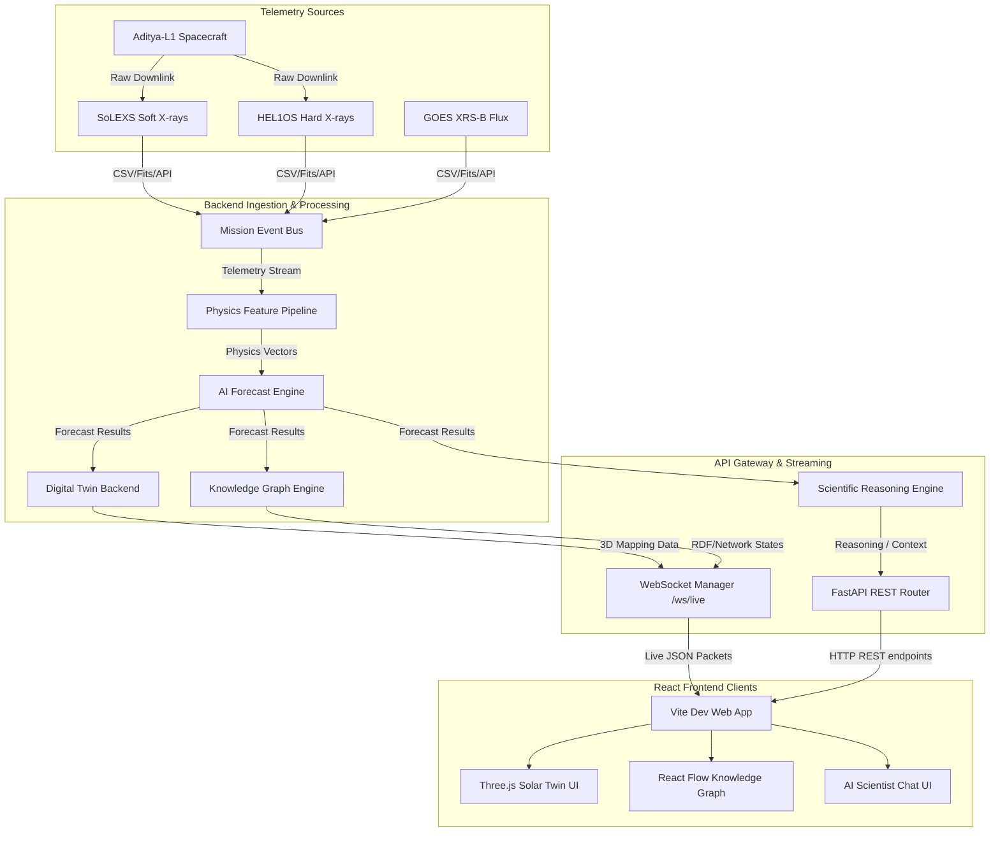
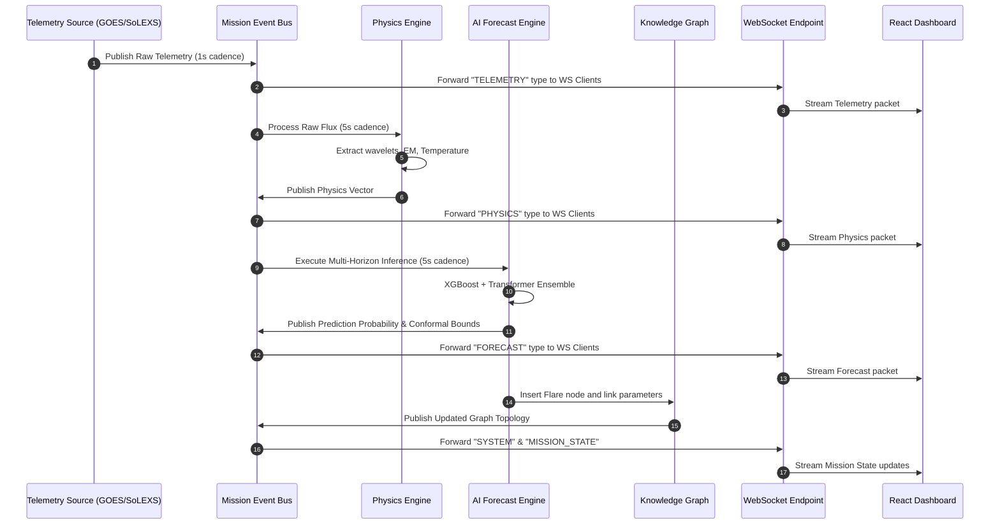

# 02. Complete System Architecture

This document details the software architecture, data flow paths, and structural layouts of the Aditya-L1 Space Weather Intelligence Platform.

---

## 🏗 End-to-End System Architecture

The platform follows a split-environment, decoupled architecture:
1.  **FastAPI Backend Gateway**: Orchestrates background workers, maintains in-memory states, processes queries, and runs the AI/Physics pipelines.
2.  **Vite/React Frontend**: Serves as a pure presentation layer, consuming live data streams via WebSockets and REST APIs, rendering interactive visualizations with Three.js and Plotly.



---

## 🗂 Layered Architecture Breakdown

The codebase is organized into five logical tiers:

```
+-------------------------------------------------------------+
|                     PRESENTATION TIER                       |
|  React 19, Vite, Three.js, React Flow, Plotly.js, Zustand   |
+-------------------------------------------------------------+
                              | (REST / WebSockets)
                              v
+-------------------------------------------------------------+
|                       GATEWAY TIER                          |
|         FastAPI REST Routers, WebSocket Endpoint            |
+-------------------------------------------------------------+
                              |
                              v
+-------------------------------------------------------------+
|                      REASONING TIER                         |
|   Scientific Reasoning Engine (SRE), LangGraph, Router      |
+-------------------------------------------------------------+
                              |
                              v
+-------------------------------------------------------------+
|                   ANALYTICS & CORE TIER                     |
|  Physics Pipeline (wavelets, thermodynamics), Ensemble AI   |
+-------------------------------------------------------------+
                              |
                              v
+-------------------------------------------------------------+
|                     INGESTION TIER                          |
|      Mission Event Bus (PubSub), Background Generator       |
+-------------------------------------------------------------+
```

---

## 📡 Live Streaming Pipeline Sequence

This diagram shows how a raw telemetry packet propagates from ingestion to the UI in real time:



---

## 🧬 Scientific Reasoning Engine (SRE) Architecture

The AI Scientist feature runs on a dynamic multi-agent context assembly engine:

```mermaid
flowchart TD
    Q[User Prompt: e.g. "Explain today's flare"] --> P[SRE Planner/Router]
    P --> |Query| CB[Context Builder]
    CB --> |Read State| AS[App State Reference]
    CB --> |Read Graph| KG[Knowledge Graph Store]
    AS --> |Current Physics & Forecast| Context[Assembled Context Object]
    KG --> |Historical Analogs| Context
    Context --> |Context + Prompt| R[Reasoner LLM/Model]
    R --> |Stream Response| WS[WebSocket/Response Chunk]
    WS --> UI[Research Workspace Chat Panel]
```

Every arrow in this diagram represents:
*   **Prompt Entry**: The user inputs a query via the `ResearchConversation.tsx` component.
*   **Context Retrieval**: `ContextBuilder` inspects `app_state` (which holds active values for temperature, entropy, emission measure, and ensemble predictions) and queries `KnowledgeGraph` for linked active region states.
*   **Response Generation**: The accumulated telemetry and historical context are combined to form the system prompt sent to the LLM router, streaming Markdown and LaTeX formulas back to the client.
