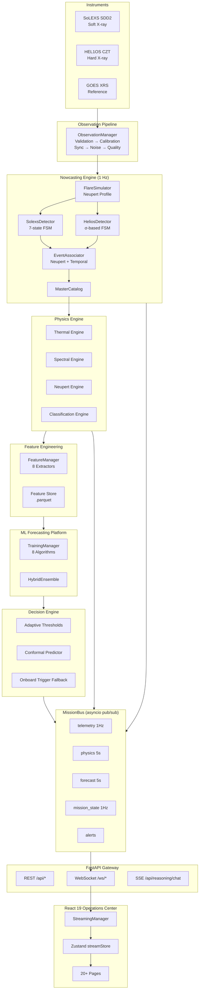
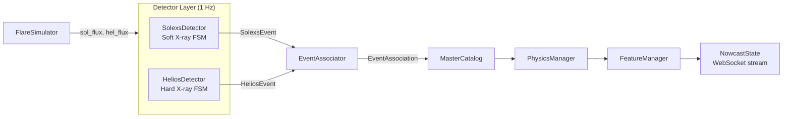
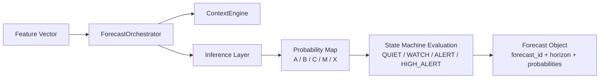
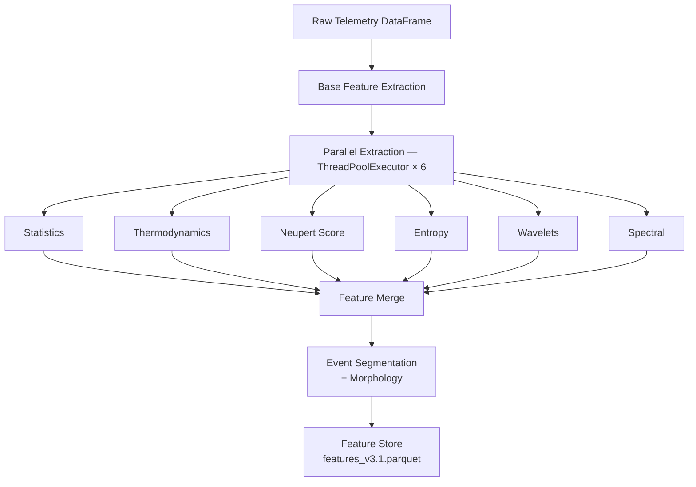
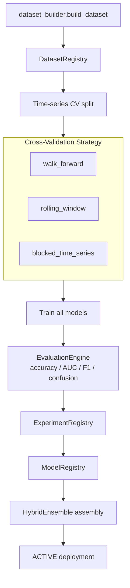
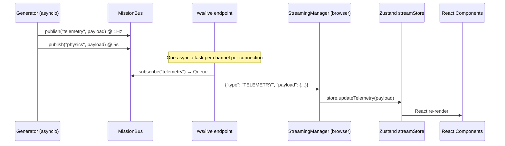

# Aditya-L1 Mission Control — Unified Space Weather Intelligence Platform

> A real-time solar flare detection, physics characterization, and machine learning forecasting platform built for the Indian Space Research Organisation's Aditya-L1 solar observatory mission.


---

## Table of Contents

1. [Project Overview](#1-project-overview)
2. [Problem Statement & Motivation](#2-problem-statement--motivation)
3. [Scientific Background](#3-scientific-background)
4. [System Architecture](#4-system-architecture)
5. [Nowcasting Engine](#5-nowcasting-engine)
6. [Forecasting Engine](#6-forecasting-engine)
7. [Physics Engine](#7-physics-engine)
8. [Machine Learning Models](#8-machine-learning-models)
9. [Decision Engine](#9-decision-engine)
10. [Observation Pipeline](#10-observation-pipeline)
11. [Multi-Modal Intelligence](#11-multi-modal-intelligence)
12. [Scientific Reasoner (AI Scientist)](#12-scientific-reasoner-ai-scientist)
13. [ML Platform](#13-ml-platform)
14. [API Reference](#14-api-reference)
15. [Frontend Architecture](#15-frontend-architecture)
16. [Real-Time Streaming Architecture](#16-real-time-streaming-architecture)
17. [Directory Structure](#17-directory-structure)
18. [Installation & Setup](#18-installation--setup)
19. [Configuration](#19-configuration)
20. [Running the Platform](#20-running-the-platform)
21. [Testing](#21-testing)
22. [Data Flow Walkthrough](#22-data-flow-walkthrough)
23. [Technology Stack](#23-technology-stack)
24. [Known Limitations](#24-known-limitations)
25. [Future Roadmap](#25-future-roadmap)
26. [Scientific References](#26-scientific-references)

---

## 1. Project Overview

**Aditya-L1 Mission Control** is an end-to-end space weather intelligence platform that transforms raw photon count-rate telemetry from ISRO's Aditya-L1 satellite instruments into actionable operational forecasts and physics characterizations — in real time.

The platform integrates three distinct pipelines:

| Pipeline | Function | Cadence |
|---|---|---|
| **Nowcasting** | Detect and characterize flares as they happen | 1 Hz |
| **Forecasting** | Predict flare class 15 min to 6 hours ahead | 5 s per cycle |
| **Physics** | Derive thermal/non-thermal properties of detected events | Per event |

It is designed as a self-contained ground-station intelligence layer: the backend is a FastAPI asyncio server that publishes to an internal pub/sub bus, and the frontend is a React 19 Operations Center that receives all state over WebSocket.

The platform also contains a **Space Onboard Trigger** model designed for direct deployment on radiation-hardened spacecraft processors — pure Python standard library, integer arithmetic only, with an explicit RAM budget of under 16 KB.

---

## 2. Problem Statement & Motivation

Solar flares are sudden, intense bursts of electromagnetic radiation from the Sun's surface. Major flares (M- and X-class on the GOES scale) can:

- Disrupt high-frequency radio communications on Earth
- Damage spacecraft electronics and solar panels
- Endanger astronauts through increased radiation exposure
- Trigger geomagnetic storms that collapse power grids

The Aditya-L1 spacecraft, placed at the Sun-Earth Lagrange point L1, carries two primary X-ray instruments:
- **SoLEXS** (Solar Low Energy X-ray Spectrometer): Monitors the soft X-ray (1–15 keV) thermal emission from flaring plasma
- **HEL1OS** (High Energy L1 Orbiting X-ray Spectrometer): Monitors the hard X-ray (15–150 keV) non-thermal emission from accelerated electrons

Real-time correlation of these two detectors — combined with the ground-based GOES XRS reference — enables early flare warning and physics characterization from a novel vantage point not previously available to ISRO.

---

## 3. Scientific Background

### 3.1 The GOES Classification System

Solar flares are classified by their peak soft X-ray flux in the 1–8 Ångström band:

| Class | Flux (W/m²) | Operational Impact |
|---|---|---|
| A | < 10⁻⁷ | Negligible |
| B | 10⁻⁷ – 10⁻⁶ | Minor |
| C | 10⁻⁶ – 10⁻⁵ | Minor radio blackouts |
| M | 10⁻⁵ – 10⁻⁴ | Radio blackouts, radiation storms |
| X | > 10⁻⁴ | Extreme events, widespread disruption |

Each class has sub-designations (e.g., M2.3, X9.3) where the number is a linear multiplier within the decade.

### 3.2 The Neupert Effect

The Neupert Effect is a fundamental relationship in solar physics: **hard X-ray emission is proportional to the time derivative of soft X-ray emission**.

**Physical interpretation**: Hard X-rays are produced by non-thermal (accelerated) electrons impacting the chromosphere. As these electrons heat the chromospheric plasma, it evaporates upward into the corona, producing the gradually rising soft X-ray thermal emission. The HXR flux therefore measures the instantaneous energy deposition rate, while the SXR integral measures total deposited energy.

Mathematically:
```
F_HXR(t) ∝ d/dt [F_SXR(t)]
```

This platform implements the Neupert Effect in three independent places:
1. **Physics Engine** (`neupert.py`) — Pearson correlation between `dSXR/dt` and `HXR`
2. **Event Association Engine** (`event_associator.py`) — rewards HEL1OS peak preceding SoLEXS peak within 60 seconds
3. **Flare Simulator** (`flare_simulator.py`) — HEL1OS burst is synthesized to precede SoLEXS thermal peak by a configurable delay

### 3.3 Hardness Ratio and Plasma Diagnostics

The ratio of hard to soft X-ray flux (the "hardness ratio") serves as a proxy for plasma temperature:

```
T_MK ≈ 15 × √(F_HXR / F_SXR)     [empirical; bounded 2–50 MK]
```

Full diagnostics require spectral fitting (XSPEC). The emission measure is explicitly returned as `NaN` with zero confidence in the current implementation — a deliberate design choice to avoid publishing physically unreliable estimates.

### 3.4 Inductive Conformal Prediction (ICP)

Standard ML models produce point estimates. For operational decision-making, uncertainty quantification is essential. The platform uses **Inductive Conformal Prediction** to wrap probability estimates in statistically valid intervals:

```
[p − q, p + q]
```

where `q` is the empirical quantile of non-conformity scores computed on a held-out calibration set. Calibration was performed on **20,451 samples** with `alpha = 0.10`, yielding `q_threshold = 0.04347`.

---

## 4. System Architecture

### 4.1 High-Level Overview



### 4.2 Event Bus Architecture

The entire backend is event-driven around a single **asyncio pub/sub bus** (`MissionBus`). At startup:

1. `AppState` is initialized (singleton), constructing all heavy engines once at process start
2. `MissionStateGenerator.start()` spawns 7 asyncio tasks at fixed cadences
3. Each task mutates a shared `MissionState` and publishes to its channel
4. `/ws/live` subscribes one asyncio task per channel per connected client; each task drains its queue and forwards JSON frames

**Channel cadences:**

| Channel | Cadence | Payload type |
|---|---|---|
| `mission_state` | 1 Hz | `MissionState` |
| `telemetry` | 1 Hz | `TelemetryState` |
| `physics` | 5 s | `PhysicsState` |
| `forecast` | 5 s | `ForecastState` |
| `digital_twin` | 5 s | `DigitalTwinState` |
| `system` | 2 s | CPU/RAM/GPU metrics |
| `alerts` | stochastic | `AlertEvent` |

---

## 5. Nowcasting Engine

The nowcasting engine detects and characterizes solar flare events in real time by running two independent instrument detectors and associating their events into a unified Master Flare Catalog.

### 5.1 Architecture



### 5.2 SoLEXS Detector

Monitors the **gradual thermal evolution** of soft X-ray flares using an adaptive EMA background and flux-ratio thresholds.

**State Machine (7 states):**

```
IDLE → MONITORING → RISING → ACTIVE → PEAK → DECAY → ENDED
```

**Parameters:**

| Parameter | Default | Description |
|---|---|---|
| `ema_alpha` | 0.02 | Background smoothing factor |
| `background_seed` | 50.0 counts/s | Initial background estimate |
| `monitoring_threshold` | 1.2× background | Ratio to enter MONITORING |
| `monitoring_persistence` | 3 samples | Consecutive samples required |
| `rising_threshold` | 1.5× background | Ratio to enter RISING (requires positive derivative) |
| `active_threshold` | 2.0× background | Ratio to enter ACTIVE |
| `decay_drop_fraction` | 0.20 | Drop below peak required for DECAY |
| `ended_threshold` | 1.3× background | Return-to-background criterion |

**Background locking**: The EMA background is frozen once the detector enters RISING. This prevents the rising flare signal from inflating the background estimate, which would artificially suppress the flux ratio and cause false early termination.

**Confidence decomposition:**

```
confidence = 0.35 × peak_ratio_score
           + 0.25 × persistence_score
           + 0.20 × derivative_score
           + 0.20 × observation_quality_score
```

Quality flag: GOOD if `obs_quality > 0.8`, DEGRADED if `> 0.5`, POOR otherwise.

### 5.3 HEL1OS Detector

Monitors **impulsive hard X-ray bursts**. Unlike the gradual SoLEXS profile, HXR bursts are rapid and use a sigma-based threshold.

**State Machine (6 states):**

```
IDLE → RISING → ACTIVE → PEAK → DECAY → ENDED
```

**Parameters:**

| Parameter | Default | Description |
|---|---|---|
| `ema_alpha` | 0.05 | Faster background update for impulsive events |
| `background_seed` | 10.0 counts/s | Initial HXR background |
| `spike_sigma` | 3.0σ | Sigma above mean to trigger detection |
| `rising_persistence` | 2 samples | Samples above threshold to confirm |
| `decay_sigma` | 2.0σ | Drop from peak to enter DECAY |
| `ended_sigma` | 1.0σ | Return to baseline criterion |
| `max_burst_duration_s` | 300 s | Auto-close ceiling |

Accumulated energy (`_total_energy`) is tracked throughout the burst and used in the confidence score.

**Confidence decomposition:**

```
confidence = 0.40 × sigma_score
           + 0.25 × duration_score
           + 0.20 × energy_score
           + 0.15 × observation_quality_score
```

### 5.4 Flare Simulator

Generates physically realistic synthetic light curves for pipeline testing and demonstration:

- **SoLEXS profile**: Half-cosine rise followed by exponential decay (models thermal heating and conductive cooling)
- **HEL1OS profile**: Sharp Gaussian burst (centered at 30% of rise time, width configurable) that **precedes** the SoLEXS peak — implementing the Neupert Effect in the simulation
- **Quiet-Sun baseline**: Gaussian noise around configurable background levels (SoLEXS: 30.0 counts/s, HEL1OS: 8.0 counts/s)
- **Injection probability**: ~0.8%/tick → approximately one flare per 125 seconds during continuous operation
- **Peak multiplier**: 3–15× above background; Duration: 30–180 seconds

### 5.5 Event Association Engine

`EventAssociator.associate()` determines whether a completed SoLEXS event and a completed HEL1OS event belong to the same physical flare.

**Three scoring criteria:**

1. **Temporal Overlap** (weight 0.40)
   ```
   score = overlap_seconds / total_combined_span
   ```

2. **Neupert Timing Score** (weight 0.35)
   ```
   if 0 ≤ (sol_peak_time - hel_peak_time) ≤ 60s:
       score = 1.0 - delay / 60          # HEL1OS peaks first: full credit
   elif reversed and |delay| < 60s:
       score = 0.3 × (1 - |delay| / 60)  # reversed timing: 30% partial credit
   ```

3. **Flux Correlation** (weight 0.25)
   ```
   score = 0.5 + 0.5 × (min(sol_peak, hel_peak) / max(sol_peak, hel_peak))
   ```

**Classification thresholds:**

| Status | Confidence |
|---|---|
| `ASSOCIATED` | ≥ 0.60 |
| `AMBIGUOUS` | 0.30 – 0.59 |
| `NOT_ASSOCIATED` | < 0.30 |

### 5.6 Master Flare Catalog

Each confirmed event produces a `MasterFlareEntry` with:
- Unified timing (start, peak, end) across instruments
- Full lifecycle tracking: `WAITING → DETECTED → CONFIRMED → ASSOCIATED → COMPLETED`
- Provenance record (`CatalogProvenance`): pipeline version, detector versions, observation IDs, update count, change log
- References to Physics Product ID and Feature Vector ID for downstream analysis

---

## 6. Forecasting Engine

Predicts future GOES flare class at multiple horizons (15 min, 30 min, 1 h, 3 h, 6 h) using trained ML models.

### 6.1 Pipeline



### 6.2 Forecast Horizons

The `/api/forecast/horizons` endpoint returns predictions for five horizons with decreasing confidence, reflecting the fundamental predictability ceiling in solar physics:

| Horizon | Confidence penalty | Description |
|---|---|---|
| 15 min | baseline | Near-term, highest confidence |
| 30 min | −5% prob, ×0.85 conf | Short-range |
| 1 h | −10% prob, ×0.75 conf | Medium-range |
| 3 h | −15% prob, ×0.60 conf | Extended |
| 6 h | −20% prob, ×0.50 conf | Outlook |

### 6.3 Adaptive Thresholds

`AdaptiveThresholdEngine` adjusts probability decision boundaries based on the current solar background (rolling 10-sample median):

| Solar Background | Factor | Rationale |
|---|---|---|
| Quiet (< B1) | +5% all thresholds | Suppress false alarms during quiet periods |
| Nominal (B1–C1) | No change | Default operation |
| Active (C1–M1) | −10% all thresholds | Heightened sensitivity during active conditions |
| Severe (≥ M1) | −20% all thresholds | Maximum sensitivity during major storms |

All adjusted values are clamped to [0.05, 0.95].

---

## 7. Physics Engine

Extracts a rich feature matrix from raw telemetry via six parallel extractors, then performs event segmentation and morphology classification.

### 7.1 Pipeline



Performance target: < 100 ms per row.

### 7.2 Statistical Features

Rolling window (default: 15 samples) over each flux channel:

| Feature | Formula |
|---|---|
| `roll_mean` | Arithmetic mean |
| `roll_std` | Standard deviation |
| `roll_median` | Median |
| `roll_var` | Variance |
| `roll_mad` | Median Absolute Deviation |
| `roll_skew` | Skewness (bias-corrected) |
| `roll_kurtosis` | Excess kurtosis (bias-corrected) |
| `roll_rms` | Root Mean Square |
| `roll_q90` | 90th percentile |
| `roll_symmetry` | (Mean − Median) / Std |

### 7.3 Information-Theoretic Features

| Feature | Algorithm | Scientific use |
|---|---|---|
| `shannon_entropy` | Histogram entropy; bins: Freedman-Diaconis | Disorder of flux distribution |
| `sample_entropy` | Approximate SampEn, m=2, r=0.2 × std | Signal regularity |
| `spectral_entropy` | Entropy of normalized periodogram PSD | Frequency complexity |

### 7.4 Wavelet Features

Uses PyWavelets with Daubechies `db4` wavelet:

| Feature | Algorithm |
|---|---|
| `wavelet_energy` | DWT level-1: Σ coefficient² (Parseval approximation) |
| `dominant_scale` | Wavelet Packet Transform: index of max-energy node |
| `hf_burst_intensity` | Max absolute DWT detail coefficient (D1) — microflare proxy |

### 7.5 Spectral Features

Computed via `scipy.signal.periodogram`, excluding the DC component:

| Feature | Formula |
|---|---|
| `spec_centroid` | Σ(f × PSD) / Σ(PSD) |
| `spec_flatness` | geometric_mean(PSD) / arithmetic_mean(PSD) |
| `spec_rolloff` | Frequency below which 85% of spectral power lies |
| `dominant_freq` | Frequency of maximum PSD |

### 7.6 Thermodynamic Features

```python
T_MK = clip(15.0 × sqrt(F_HXR / F_SXR), 2.0, 50.0)
EM   = NaN   # requires XSPEC spectral fitting; returned NaN by design
```

**Design note**: The unit test explicitly asserts `df['estimated_em_norm'].isnull().all()`. This is intentional — producing a non-NaN EM without XSPEC fitting would be a physically misleading result.

### 7.7 Neupert Score

```python
r, _ = pearsonr(gradient(SXR_window), HXR_window)
neupert_score = r   # range: −1.0 to +1.0
```

Applied as a rolling window (default: 15 samples). A score near +1.0 indicates textbook Neupert-effect behavior.

### 7.8 Event Segmentation and Morphology

`segment_events_and_timeline()` performs threshold-based flare detection (default: 100 counts/s) and classifies each sample into a **physics timeline**:

- `Background` — flux below threshold
- `Rise` — flux increasing toward peak
- `Peak` — near maximum
- `Decay` — post-peak exponential decline

End condition: flux < 50% of threshold for more than 5 consecutive ticks after peak.

**Morphology classification per event:**
- `Impulsive` — rise time ≤ 30% of total duration
- `Gradual` — long, symmetric profile
- `Complex` — multi-peak structure

### 7.9 Post-Nowcast Physics Characterization Pipeline

After the nowcasting engine produces a `MasterFlareEntry`, `PhysicsManager` runs eight sub-engines:

1. **CharacterizationEngine** — temporal profile (peak flux, duration, rise/decay times)
2. **ClassificationEngine** — GOES class mapping from calibrated flux
3. **ThermalEngine** — temperature and emission measure from SoLEXS + HEL1OS
4. **NonThermalEngine** — power-law index from HEL1OS burst
5. **SpectralEngine** — spectral features from both channels
6. **PlasmaEngine** — plasma density proxy
7. **NeupertEngine** — full Neupert consistency check for the event
8. **IndicesEngine** — derived science indices

The result is a `PhysicsCharacterization` object stored in `physics_repository` and referenced by ID from the catalog entry.

---

## 8. Machine Learning Models

The platform implements **11 distinct model architectures** across two layers: classical tabular algorithms via the offline `TrainingManager`, and deep learning architectures in the `aditya_flare/ai_engine/` package.

### 8.1 Tabular Models

| Model | Library | Notes |
|---|---|---|
| **XGBoost** | `xgboost` | Primary tabular baseline |
| **LightGBM** | `lightgbm` | Histogram-based GBDT, fast training |
| **CatBoost** | `catboost` | Symmetric GBDT, handles categoricals |
| **Random Forest** | `sklearn` | Bagging ensemble for diversity |

### 8.2 Deep Learning — TCN (Temporal Convolutional Network)

**Architecture**: Dilated causal 1D convolutions with residual connections.

```
Input → [TemporalBlock(dilation=1) → TemporalBlock(dilation=2) → ...]
TemporalBlock: Conv1D → Chomp1d → ReLU → Dropout → Conv1D → Chomp1d → ReLU → Dropout + residual
```

- `Chomp1d` removes right-padding to enforce strict causality (no future data leakage)
- Exponential dilation: 2⁰, 2¹, 2², ... — receptive field grows exponentially with depth
- Weight normalization applied to all Conv1D layers

### 8.3 Deep Learning — Physics-Aware TCN

Extends the baseline TCN with an **adaptive gating mechanism** for physics feature injection:

```
gate = Sigmoid(Linear(raw_features))             # context-dependent gate ∈ [0, 1]
gated_physics = Linear(physics_features) × gate
input_to_TCN = concat(raw_features, gated_physics)
```

The gate is computed from raw telemetry alone — the model learns **when** to trust derived physics features. During noisy or degraded telemetry, the gate can suppress unreliable derived quantities.

### 8.4 Deep Learning — Temporal Transformer (Causal)

Encoder-only Transformer with **causal self-attention masking**:

```
Input → Linear projection → Sinusoidal Positional Encoding
     → Transformer Encoder (4 layers, d_model=128, nhead=8, FFN=512, GELU)
     → Last token hidden state → Linear → Sigmoid → P(flare)
```

Causal mask: upper-triangular matrix filled with −∞, ensuring position `t` only attends to positions ≤ `t`. No future information leaks into the prediction.

### 8.5 Deep Learning — Dual-Stream Network

Designed specifically for the SXR/HXR multi-instrument problem:

```
SXR stream  → GRU(d=128, layers=2) → h_SXR
HXR stream  → GRU(d=128, layers=2) → h_HXR
Physics     → Linear               → emb_physics

h_SXR + emb_physics → CrossAttention(Q=SXR, K=V=HXR) → fused_SXR
concat(last(fused_SXR), last(h_HXR)) → Late Fusion FC → Sigmoid → probability
```

**Cross-Attention**: The soft X-ray stream attends to the hard X-ray stream. The model can learn the temporal lag relationship (Neupert Effect) — when the HXR burst is predictive of an impending SXR peak.

### 8.6 Deep Learning — GRU and LSTM

Standard recurrent architectures:
- **GRU** (Gated Recurrent Unit): reset/update gates; lighter and faster than LSTM
- **LSTM** (Long Short-Term Memory): forget/input/output gates; better long-range dependencies

### 8.7 Hybrid Ensemble

`HybridEnsemble` performs weighted combination of all trained models:

```python
final_prob = w_ai × ai_prob + w_xgb × xgb_prob
```

**Dynamic weighting** (`dynamic_weighting=True`): weights are inversely proportional to the model's predicted uncertainty (lower uncertainty → higher weight).

### 8.8 Training Pipeline



**Label encoding**: GOES class → integer {A:0, B:1, C:2, M:3, X:4}  
**Targets**: `goes_class_next_30m`, `goes_class_next_1h` (classification); `peak_flux_next_flare` (regression)  
**Fallback dataset**: 50-sample synthetic data if no feature store exists (proportions: A:40%, B:30%, C:20%, M:8%, X:2%)

### 8.9 Space Onboard Trigger

A **radiation-hardened compatible** state machine for direct spacecraft deployment:

**Hardware constraints:**
- Zero external dependencies (pure Python standard library)
- Integer arithmetic only
- RAM budget: < 16 KB
- Target: LEON3 / SPARC V8 @ 20–50 MHz

**Detection logic (5-sample circular buffer):**
- Computes `dF/dt` (first derivative) and `d²F/dt²` (second derivative) via finite differences
- `QUIET → WATCH`: `dF/dt ≥ 30` counts/s²
- `WATCH → ALERT`: `dF/dt ≥ 150` counts/s² OR sustained rise with positive curvature
- `ALERT → QUIET`: 60-second cooldown AND flux drops below 70% of peak
- Absolute limit fallback: forces ALERT when counts ≥ 400 counts/s regardless of derivative

The onboard trigger runs continuously and takes over if `DecisionEngine` detects telemetry gaps or data degradation.

---

## 9. Decision Engine

`DecisionEngine` integrates all analysis layers into operational state decisions, confidence bounds, and recommendations.

### 9.1 Operational States

| State | Probability threshold | Flux equivalent |
|---|---|---|
| `QUIET` | < 0.20 | < B5 |
| `WATCH` | 0.20 – 0.40 | B5 – C1 |
| `PRE_ALERT` | 0.40 – 0.70 | C1 – M1 |
| `ALERT` | 0.70 – 0.90 | M1 – X1 |
| `HIGH_ALERT` | ≥ 0.90 | ≥ X1 |
| `RECOVERY` | (transitioning down) | — |

### 9.2 Decision Flow (per evaluation cycle)

```
1. Telemetry health check  →  GAP / DEGRADED / NOMINAL
2. Drift detection         →  distribution shift in incoming features
3. SpaceOnboardTrigger update  (always running as backup)
4. If GAP/DEGRADED         →  fallback to onboard trigger state
5. If NOMINAL              →  adaptive threshold evaluation on ML probability
6. Conformal prediction    →  [p − q, p + q] interval; flag if width > 0.40
7. Recommendation engine   →  operational mode recommendations
8. Alert dispatch          →  push to alerts channel on state escalation
```

Configuration is **hot-reloaded** on every evaluation cycle via `reload_config()`.

### 9.3 GOES Flux Calibration

Maps raw SoLEXS count rates (counts/s) to physical GOES flux (W/m²):

```
log₁₀(F_GOES) = 0.639 × log₁₀(cps) − 6.715
```

Valid range: [2.817, 12226.983] counts/s. Polynomial coefficients are also stored for cross-validation.

### 9.4 Conformal Prediction Bounds

- Coverage guarantee: 90% marginal coverage (alpha = 0.10)
- `q_threshold = 0.04347` (empirical quantile from 20,451 calibration samples)
- Method: absolute residual
- Low-confidence flag: interval width > 0.40

---

## 10. Observation Pipeline

`ObservationManager` processes raw telemetry into `EnrichedObservation` objects through a six-stage pipeline:

| Stage | Engine | Function |
|---|---|---|
| 1 | `ValidationEngine` | Range, type, and cross-channel consistency checks |
| 2 | `CalibrationEngine` | Convert raw counts to physical units using GOES calibration |
| 3 | `SynchronizationEngine` | Align timestamps across instruments |
| 4 | `NoiseBackgroundEngine` | Estimate pre-flare background and SNR |
| 5 | `QualityEngine` | Composite quality score from all sub-results |
| 6 | `MetadataProvenanceEngine` | Stamp pipeline version and processing latency |

Each `EnrichedObservation` carries: physical fluxes, full provenance record, quality assessment, and calibration details.

---

## 11. Multi-Modal Intelligence

### 11.1 Solar Digital Twin

`SolarDigitalTwin` maintains a live representation of the Sun's state:

- Tracks active regions using HMI-derived features: `USFLUX` (unsigned flux), `MEANSHR` (mean field shear), AIA heating proxy
- Maintains global solar state: XRS background, proton flux, estimated Kp
- Historical similarity search via Euclidean distance in normalized (magnetic_flux, shear) space

```python
distance = sqrt(((current_flux − hist_flux) / 1e22)² + ((current_shear − hist_shear) / 10)²)
```

Historical reference DB includes: AR12673 (X9.3 flare), AR11520 (X1.4), AR13354 (M1.2).

### 11.2 Event Knowledge Graph

`EventKnowledgeGraph` maintains a **directed graph** (NetworkX `DiGraph`):

- **Nodes**: Active Regions (AR), Flares, CMEs, SEPs with feature dictionaries
- **Edges**: Causal and temporal relationships (AR → Flare, Flare → CME, Flare → SEP)
- `add_event(type, features, related_to=None, relation_type="temporal")`

Visualized on the Knowledge Graph page using `@xyflow/react` with ELK hierarchical layout.

### 11.3 Mission Intelligence Engine

`MissionIntelligenceEngine` (PyTorch `nn.Module`) computes three operational risk indices:

```
fused_rep (128-dim) → FoundationEmbeddingHead → L2-normalized embedding (256-dim)
embedding → three separate MLP heads → 0–10 risk indices (sigmoid × 10)
```

| Index | Description |
|---|---|
| **Mission Risk Index (MRI)** | Overall risk to spacecraft and instruments |
| **Radiation Context Index (RCI)** | Proton/electron radiation environment severity |
| **HF Blackout Risk Index** | Probability of HF radio blackout on Earth |

---

## 12. Scientific Reasoner (AI Scientist)

A multi-agent reasoning system that answers natural language solar physics queries using live platform context.

### 12.1 Pipeline

```
User Query
  → ContextBuilder  (telemetry + physics + forecast + graph state aggregation)
  → Planner         (intent classification, ordered subtask plan)
  → Router          (dispatch to registered specialist agents)
  → Agents          (execute assigned subtasks)
  → ReviewAgent     (cross-agent critique and consistency check)
  → SSE stream      (JSON chunks to frontend)
```

### 12.2 Registered Agents (10 total)

| Agent | Responsibility |
|---|---|
| `PhysicsAgent` | Thermal and non-thermal physics analysis |
| `PredictionAgent` | Forecast interpretation and confidence assessment |
| `DigitalTwinAgent` | Active region state and historical similarity |
| `KnowledgeGraphAgent` | Event graph traversal and causal chain analysis |
| `MissionAgent` | Risk index context and operational recommendations |
| `SpectralAgent` | Spectral feature analysis and frequency characteristics |
| `LiteratureAgent` | Scientific context from solar physics literature |
| `ExperimentAgent` | Dataset and experiment registry queries |
| `ReportAgent` | Full mission intelligence report generation |
| `ReviewAgent` | Cross-agent critique and consistency enforcement |

### 12.3 Streaming Protocol

Results are streamed via **Server-Sent Events (SSE)** at `POST /api/reasoning/chat`. Each chunk:

```json
{ "type": "plan",         "intent": "physics_analysis", "agent_count": 3 }
{ "type": "agent_result", "agent": "physics", "content": "...", "confidence": 0.87 }
{ "type": "complete",     "confidence": 0.85, "sources": [...] }
```

Memory: `ResearchMemory` stores conversation history for multi-turn reasoning.

---

## 13. ML Platform

A full offline ML lifecycle system — training, registering, evaluating, and serving models.

### 13.1 Components

| Component | Location | Function |
|---|---|---|
| `TrainingManager` | `ml/training/training_manager.py` | Full pipeline orchestration |
| `ModelRegistry` | `ml/registry/model_registry.py` | Model metadata and deployment stages |
| `ExperimentRegistry` | `ml/experiments/experiment_registry.py` | MLflow-style run logging |
| `DatasetRegistry` | `ml/datasets/dataset_registry.py` | Dataset versioning and lineage |
| `EvaluationEngine` | `ml/evaluation/evaluation_engine.py` | Accuracy, AUC, F1, confusion matrix |
| `MonitoringManager` | `ml/monitoring/monitoring_manager.py` | Ongoing performance drift detection |
| `TimeSeriesCrossValidator` | `ml/training/cross_validation.py` | All three CV strategies |

### 13.2 Cross-Validation Strategies

All strategies guarantee training data precedes validation data in time:

| Strategy | Description |
|---|---|
| `walk_forward` (n_splits=3) | Expanding training window; test window slides forward |
| `rolling_window` | Fixed-size training window slides forward |
| `blocked_time_series` | Non-overlapping contiguous blocks |

### 13.3 Explainability (XAI)

`backend/xai/` provides:
- **Feature Importance**: SHAP values and permutation importance
- **Scientific Reasoning**: Physics-informed explanation generation
- **Provenance**: Full audit trail from input feature to final prediction
- **Trust**: Calibration curves and reliability diagrams

---

## 14. API Reference

All REST endpoints are prefixed `/api`. WebSocket endpoints are under `/ws`.

### 14.1 Core

| Method | Path | Description |
|---|---|---|
| `GET` | `/api/health` | Health check |
| `GET` | `/api/dashboard` | Dashboard summary |
| `GET` | `/api/operations` | Current operational state |

### 14.2 Forecast

| Method | Path | Description |
|---|---|---|
| `GET` | `/api/forecast/current` | Latest prediction |
| `GET` | `/api/forecast/horizons` | Predictions for 15m/30m/1h/3h/6h |

**Response (current):**
```json
{
  "probability": 0.73,
  "estimated_flux": 2.4e-5,
  "estimated_goes_class": "M2.4",
  "confidence": 0.91
}
```

### 14.3 Physics

| Method | Path | Description |
|---|---|---|
| `GET` | `/api/physics/state` | Latest physics state |
| `GET` | `/api/physics/product/{id}` | Physics characterization by ID |
| `GET` | `/api/physics/by-catalog/{master_id}` | Physics via catalog entry ID |
| `GET` | `/api/physics/thermal/{id}` | Thermal profile |
| `GET` | `/api/physics/spectral/{id}` | Spectral profile |
| `GET` | `/api/physics/neupert/{id}` | Neupert analysis |
| `GET` | `/api/physics/classification/{id}` | GOES class |
| `GET` | `/api/physics/indices/{id}` | Physics indices |
| `GET` | `/api/physics/quality/{id}` | Quality assessment |
| `GET` | `/api/physics/repository/history` | Historical products |
| `GET` | `/api/physics/repository/statistics` | Aggregate statistics |
| `GET` | `/api/physics/repository/export` | Export all physics products |
| `GET` | `/api/physics/detector/benchmark` | Detector benchmarks |

### 14.4 ML Platform

| Method | Path | Description |
|---|---|---|
| `GET` | `/api/ml/models` | All registered models |
| `GET` | `/api/ml/registry` | Active model and readiness |
| `GET` | `/api/ml/experiments` | All logged experiments |
| `GET` | `/api/ml/datasets` | All registered datasets |
| `GET` | `/api/ml/targets` | Prediction target definitions |
| `POST` | `/api/ml/train` | Trigger training (background task) |
| `GET` | `/api/ml/evaluation` | Metrics and confusion matrices |

**Train request:**
```json
{
  "algorithm": "all",
  "cv_strategy": "walk_forward",
  "target_label": "goes_class_next_1h"
}
```

### 14.5 Nowcasting

| Method | Path | Description |
|---|---|---|
| `GET` | `/api/nowcasting/state` | Current nowcast state |
| `GET` | `/api/nowcasting/catalog` | Master flare catalog |
| `GET` | `/api/nowcasting/timeline` | Event timeline |
| `GET` | `/api/nowcasting/benchmark` | Detector benchmarks |

### 14.6 Scientific Reasoning

| Method | Path | Description |
|---|---|---|
| `POST` | `/api/reasoning/chat` | **SSE stream** — scientific query |
| `POST` | `/api/reasoning/analyze` | Synchronous deep analysis |
| `POST` | `/api/reasoning/report` | Full mission report |
| `POST` | `/api/reasoning/compare` | Compare events or predictions |
| `GET` | `/api/reasoning/context` | Current platform context |
| `GET` | `/api/reasoning/history` | Conversation history |

**Chat request body:**
```json
{
  "query": "What is the current plasma temperature?",
  "session_id": "sess-001"
}
```

### 14.7 WebSocket Endpoints

| Path | Description |
|---|---|
| `/ws/live` | All mission channels at respective cadences |
| `/ws/observation` | Real-time enriched observation stream |
| `/ws/nowcasting` | Real-time NowcastState at 1 Hz |
| `/ws/ml` | ML platform status updates |

**WebSocket frame format:**
```json
{
  "type": "TELEMETRY",
  "payload": {
    "solexs_sdd2_ctr": 142.3,
    "helios_czt_broad_ctr": 28.1,
    "goes_xrs_b": 2.4e-6,
    "goes_xrs_a": 3.1e-7,
    "proton_flux_10MeV": 0.23,
    "timestamp": "2026-06-28T14:32:01.000Z"
  }
}
```

**Type values:** `MISSION_STATE`, `TELEMETRY`, `PHYSICS`, `FORECAST`, `DIGITAL_TWIN`, `SYSTEM`, `ALERTS`

---

## 15. Frontend Architecture

### 15.1 Application Structure

```
frontend/src/
├── app/
│   ├── routes.tsx          # 22+ lazy-loaded routes under <Layout>
│   └── providers.tsx       # TanStack Query + theme providers
├── realtime/
│   ├── socket.ts           # StreamingManager singleton
│   └── streamStore.ts      # Zustand — rolling 100-sample history
├── features/
│   ├── mission/            # Shell, Overview, Operations, Alerts, Timeline, Intelligence, Collaboration
│   ├── forecast/           # ForecastingPage
│   ├── physics/            # PhysicsLabPage
│   ├── ai-scientist/       # AiScientistPage (SSE chat)
│   ├── digital-twin/       # DigitalTwinPage, ActiveRegionsPage
│   ├── knowledge-graph/    # KnowledgeGraphPage, AssetManagerPage
│   ├── investigation/      # SpectralAnalysisPage, SensorInspectorPage
│   ├── research/           # ResearchPage
│   └── admin/              # AdminPage, DesignSystemPage, SystemDiagnosticsPage, LogsPage, ConfigurationPage
├── design-system/          # Shared UI primitives, skeletons, error boundaries
├── components/             # Layout, charts, shared widgets
├── api/
│   ├── client.ts           # Base fetchClient with error handling
│   └── endpoints.ts        # Typed endpoint definitions
└── store/                  # Additional Zustand stores
```

### 15.2 Route Map

| Route | Page |
|---|---|
| `/` | ShellPage — Mission control landing |
| `/platform` | PlatformPage |
| `/overview` | OverviewPage |
| `/operations` | OperationsPage |
| `/forecast` | ForecastingPage |
| `/operations/alerts` | AlertsPage |
| `/operations/timeline` | TimelinePage |
| `/intelligence` | IntelligencePage |
| `/ai` | AiScientistPage |
| `/physics` | PhysicsLabPage |
| `/digital-twin` | DigitalTwinPage |
| `/knowledge-graph` | KnowledgeGraphPage |
| `/asset-manager` | AssetManagerPage |
| `/research` | ResearchPage |
| `/collaboration` | CollaborationPage |
| `/admin` | AdminPage |
| `/design-system` | DesignSystemPage |
| `/spectral` | SpectralAnalysisPage |
| `/sensors` | SensorInspectorPage |
| `/regions` | ActiveRegionsPage |
| `/diagnostics` | SystemDiagnosticsPage |
| `/system/logs` | LogsPage |
| `/system/config` | ConfigurationPage |

All routes are wrapped in `React.lazy()` with `<Suspense>` and `AppErrorBoundary`.

### 15.3 State Management

**`streamStore` (Zustand)**: Real-time WebSocket state
- `mission: MissionState | null`
- `history.telemetry: TelemetryState[]` — rolling 100 samples
- `history.physics: PhysicsState[]` — rolling 100 samples
- `alerts: AlertEvent[]` — capped at 20, newest first
- `connectionStatus`: connecting / connected / disconnected / reconnecting

**TanStack Query**: REST endpoint cache (model registry, physics history, etc.)

### 15.4 Visualization Stack

| Library | Used for |
|---|---|
| Plotly.js | Time series, spectral plots, confusion matrices, feature importance |
| Three.js + @react-three/fiber + @react-three/drei | 3D solar visualizations, digital twin |
| @xyflow/react + elkjs | Knowledge graph, flowcharts with ELK hierarchical layout |
| KaTeX + rehype-katex + remark-math | Inline LaTeX equations in AI Scientist output |
| react-markdown + remark-gfm | Markdown rendering for reasoner responses |

### 15.5 Path Aliases

Defined in both `vite.config.ts` and `tsconfig.json`:

```
@            → src/
@app         → src/app/
@components  → src/components/
@features    → src/features/
@hooks       → src/hooks/
@store       → src/store/
@services    → src/services/
@utils       → src/utils/
@app-types   → src/types/
@constants   → src/constants/
@styles      → src/styles/
@assets      → src/assets/
@design-system → src/design-system/
```

---

## 16. Real-Time Streaming Architecture



### 16.1 Reconnection

Exponential backoff: `timeout = min(1000 × 1.5^attempt, 10000)` ms, max 10 attempts.

### 16.2 Heartbeat

Every 10 seconds: `{ "action": "ping" }` — keeps connection alive through load balancers and proxies.

---

## 17. Directory Structure

```
Unified Data Ingestion Engine/
├── backend/
│   ├── api/
│   │   ├── main.py              # FastAPI app, lifespan, router registration (18 REST + 4 WS)
│   │   ├── state.py             # AppState singleton — all heavy engines constructed here
│   │   ├── mock_data.py         # Fallback generators when live data is absent
│   │   ├── routes/              # REST routers (health, dashboard, forecast, physics, ml, ...)
│   │   └── ws/                  # WebSocket routers (live, observation, nowcasting, ml)
│   ├── events/
│   │   ├── mission_bus.py       # asyncio pub/sub backbone
│   │   ├── generator.py         # MissionStateGenerator (7 asyncio tasks)
│   │   └── models.py            # Pydantic schemas for all streaming payloads
│   ├── nowcasting/
│   │   ├── manager.py           # NowcastManager — central orchestrator + singleton
│   │   ├── models.py            # DetectorState, FlarePhase, MasterFlareEntry, NowcastState
│   │   ├── config.py            # NowcastConfig — aggregated Pydantic config
│   │   ├── detectors/           # SolexsDetector, HeliosDetector, DetectorBenchmark
│   │   ├── association/         # EventAssociator
│   │   ├── catalog/             # MasterCatalog
│   │   ├── tracking/            # EventTracker
│   │   ├── timeline/            # EventTimeline
│   │   ├── repository/          # NowcastRepository (in-memory + export)
│   │   ├── simulation/          # FlareSimulator, FlareProfile
│   │   └── buffers/             # SlidingBuffer (push, derivative, std, fill_fraction)
│   ├── physics_engine/          # Standalone feature extraction (unit-tested)
│   │   ├── feature_pipeline.py  # Master aggregator with ThreadPoolExecutor
│   │   ├── statistics.py        # Rolling statistical moments
│   │   ├── entropy.py           # Shannon, sample, spectral entropy
│   │   ├── wavelets.py          # DWT energy, WPT dominant scale, HF burst
│   │   ├── spectral.py          # Centroid, flatness, rolloff (periodogram)
│   │   ├── thermodynamics.py    # T_MK, EM (intentional NaN)
│   │   ├── neupert.py           # Pearson correlation dSXR/dt vs HXR
│   │   └── event_segmentation.py # Flare timeline + morphology classification
│   ├── physics/                 # Post-nowcast event characterization
│   │   ├── manager.py           # PhysicsManager — 8 sub-engines in sequence
│   │   └── [thermal, nonthermal, spectral, plasma, neupert, classification, characterization, indices]/
│   ├── features/                # Feature engineering platform
│   │   ├── manager.py           # FeatureManager — extract→validate→normalize→quality→lineage→store
│   │   └── [extractors, registry, validation, normalization, quality, lineage, statistics]/
│   ├── ml/                      # ML lifecycle management
│   │   ├── training/            # TrainingManager, TimeSeriesCrossValidator
│   │   ├── models/              # Model wrappers for all algorithms
│   │   ├── registry/            # ModelRegistry (JSON-backed)
│   │   ├── experiments/         # ExperimentRegistry
│   │   ├── datasets/            # DatasetRegistry
│   │   ├── evaluation/          # EvaluationEngine
│   │   ├── serving/             # serving_apis.py (FastAPI router)
│   │   └── monitoring/          # MonitoringManager
│   ├── aditya_flare/            # Core science library
│   │   ├── decision/            # DecisionEngine, state_machine, adaptive_thresholds, conformal
│   │   ├── calibration/         # calibration_config.yaml, conformal_config.yaml, GOES calibrator
│   │   ├── config/              # Config dataclass, settings.yaml, hot-reload
│   │   ├── models/              # space_trigger.py (onboard FSM), forecaster.py
│   │   ├── multi_modal/         # SolarDigitalTwin, EventKnowledgeGraph, MissionIntelligenceEngine
│   │   └── ai_engine/           # Deep learning: dual_stream, transformer, physics_aware_tcn, tcn
│   ├── observation_engine/      # Enriched observation pipeline (6 stages)
│   ├── reasoning/               # Scientific Reasoner — 10 agents, SSE streaming
│   ├── forecasting/             # ForecastOrchestrator + sub-modules
│   ├── xai/                     # SHAP, provenance, trust, scientific reasoning
│   ├── platform/                # Monitoring, diagnostics, configuration, audit
│   ├── scripts/                 # Standalone CLIs (train, evaluate, download, catalog)
│   ├── tests/                   # pytest test suite
│   ├── data/                    # (git-ignored) raw, processed, feature_store, models
│   ├── requirements.txt         # Full ML/data science stack
│   └── requirements-api.txt     # Minimal API server dependencies
├── frontend/
│   ├── src/                     # React 19 source (see §15)
│   ├── package.json
│   ├── vite.config.ts           # Proxy + path aliases + manual chunks
│   └── dist/                    # Production build output
├── shared/                      # Cross-cutting definitions
│   ├── api/                     # Shared API contract types
│   ├── constants/               # Shared constants
│   ├── events/                  # Shared event schemas
│   ├── schemas/                 # Shared validation schemas
│   └── types/                   # Shared TypeScript/Python types
├── .env.example
├── CLAUDE.md                    # AI assistant project instructions
└── README.md                    # This document
```

---

## 18. Installation & Setup

### 18.1 Prerequisites

| Requirement | Version |
|---|---|
| Python | 3.11+ (developed on 3.14) |
| Node.js | 18+ |
| npm | 9+ |
| git | Any recent version |

### 18.2 Clone and Install

```bash
git clone <repository-url>
cd "Unified Data Ingestion Engine"

# --- Backend (run ALL python commands from the repo root) ---
python -m venv .venv
source .venv/bin/activate          # Windows: .venv\Scripts\activate

# Minimal API server dependencies
pip install -r backend/requirements-api.txt

# Full ML/data science stack (required for training scripts)
pip install -r backend/requirements.txt

# --- Frontend ---
cd frontend && npm install && cd ..
```

**Critical**: The `backend/` package uses **absolute imports with the `backend.` prefix** throughout (e.g., `from backend.events.mission_bus import mission_bus`). All Python commands — server, tests, scripts — must be run from the **repository root**. Running from inside `backend/` will cause `ModuleNotFoundError`.

### 18.3 Environment Variables

```bash
# Root — Docker/orchestration only
COMPOSE_PROJECT_NAME=aditya_l1
DOCKER_PORT_FRONTEND=80
DOCKER_PORT_BACKEND=8000
ENVIRONMENT=development

# Frontend — create frontend/.env.local for local dev
VITE_API_BASE_URL=http://localhost:8000/api
VITE_WS_BASE_URL=ws://localhost:8000/ws
```

---

## 19. Configuration

### 19.1 Operational Thresholds (`backend/aditya_flare/config/settings.yaml`)

Controls state machine transitions. **Hot-reloaded on every evaluation cycle.**

```yaml
operational_state:
  probability_thresholds:
    watch: 0.2
    pre_alert: 0.4
    alert: 0.7
    high_alert: 0.9
```

### 19.2 GOES Calibration (`backend/aditya_flare/calibration/calibration_config.yaml`)

```yaml
scale:
  slope: 0.6391         # log10(F_GOES) = slope × log10(cps) + intercept
  intercept: -6.7147
polynomial:
  a: 0.01635
  b: 0.5773
  c: -6.6618
bounds:
  lower: 2.817          # Minimum valid count rate (cts/s)
  upper: 12226.983      # Maximum valid count rate (cts/s)
```

### 19.3 Conformal Prediction (`backend/aditya_flare/calibration/conformal_config.yaml`)

```yaml
method: absolute_residual
alpha: 0.10
q_threshold: 0.04347
n_calibration_samples: 20451
```

### 19.4 Nowcast Detector Config (`backend/nowcasting/config.py`)

All detector parameters are Pydantic `BaseModel` fields. Load from file or override programmatically:

```python
from backend.nowcasting.config import NowcastConfig, SolexsDetectorConfig

config = NowcastConfig.load_config("config.yaml")

# Or programmatic override:
config = NowcastConfig(
    solexs=SolexsDetectorConfig(monitoring_threshold=1.3, rising_persistence=7)
)
```

---

## 20. Running the Platform

### 20.1 Backend API Server

```bash
source .venv/bin/activate
uvicorn backend.api.main:app --host 0.0.0.0 --port 8000 --reload
```

Interactive API docs: `http://localhost:8000/docs`

### 20.2 Frontend Development Server

```bash
cd frontend && npm run dev
```

Available at `http://localhost:5173`. Vite proxies `/api/*` to `:8000` automatically.

### 20.3 Streamlit Nowcasting Dashboard

Standalone Streamlit app using the XGBoost model:

```bash
source .venv/bin/activate
streamlit run backend/scripts/app.py
```

Requires a trained model at `data/models/xgboost_nowcast.json`.

### 20.4 Training Models

```bash
# Via CLI script
python backend/scripts/train_xgboost.py

# Via API (triggers background task)
curl -X POST http://localhost:8000/api/ml/train \
  -H "Content-Type: application/json" \
  -d '{"algorithm": "all", "cv_strategy": "walk_forward", "target_label": "goes_class_next_1h"}'
```

### 20.5 Frontend Production Build

```bash
cd frontend
npm run build    # Output: frontend/dist/
npm run lint     # ESLint
```

### 20.6 Standalone Scripts

All scripts must be run from the repo root:

```bash
python -m backend.scripts.generate_master_catalog
python -m backend.scripts.evaluate_lead_time
python -m backend.scripts.download_goes_flares
python -m backend.scripts.run_operations_daemon
```

---

## 21. Testing

### 21.1 Running Tests

```bash
# All backend tests (from repo root)
python -m pytest backend/tests

# Single file
python -m pytest backend/tests/test_physics_engine.py -v

# Specific test by keyword
python -m pytest backend/tests/test_physics_engine.py -k neupert -v

# With coverage report
python -m pytest backend/tests --cov=backend --cov-report=html
```

### 21.2 Test Coverage

| File | Tests |
|---|---|
| `test_physics_engine.py` | Statistics, entropy, wavelets, spectral, thermodynamics, Neupert score, morphology, pipeline |
| `test_calibration.py` | GOES calibration, conformal bounds |
| `test_features.py` | Feature extraction, validation, normalization, quality gates |
| `test_metrics.py` | Evaluation metrics |
| `test_data_merger.py` | Multi-instrument timestamp alignment |
| `test_time_utils.py` | Time series utilities |
| `test_explainability.py` | SHAP explainability |

### 21.3 Key Assertions

```python
# Neupert score — perfect correlation should score > 0.9
soft = np.array([1, 2, 4, 8, 16])
hard = np.array([1, 2, 4, 8, 16])
score = compute_neupert_score(soft, hard)
assert score > 0.9

# Thermodynamics — EM should be NaN without XSPEC (by design)
assert df['estimated_em_norm'].isnull().all()

# Event segmentation — timeline must include both Peak and Background stages
assert 'Peak' in df_out['physics_timeline'].values
assert 'Background' in df_out['physics_timeline'].values
```

---

## 22. Data Flow Walkthrough

Complete trace from raw instrument signal to browser display:

```mermaid
graph TD
    A["Raw Instrument Signal\nSoLEXS: count rate (cps)\nHEL1OS: CZT count rate (cps)\nGOES XRS: flux (W/m²)\nProton flux: MeV particles"]

    A --> B["ObservationManager\n1. Validate ranges\n2. Apply GOES calibration\n3. Synchronize timestamps\n4. Estimate noise/background\n5. Quality score\n6. Stamp provenance"]

    B --> C["EnrichedObservation\nphysical fluxes + quality + provenance"]

    C --> D["FlareSimulator (demo mode)\nGenerates Neupert-effect light curves"]

    D --> E1["SolexsDetector\nEMA background → flux ratio → 7-state FSM"]
    D --> E2["HeliosDetector\nσ-based → 6-state FSM"]

    E1 --> F["EventAssociator\nTemporal overlap + Neupert timing\n+ flux correlation"]
    E2 --> F

    F --> G["MasterCatalog\nMasterFlareEntry\nWAITING → COMPLETED lifecycle"]

    G --> H["PhysicsManager\n8 sub-engines:\nThermal, NonThermal, Spectral\nPlasma, Neupert, Classification\nCharacterization, Indices"]

    H --> I["PhysicsCharacterization\nStored → PhysicsRepository"]

    I --> J["FeatureManager\n8 typed extractors\nExtract → Validate → Normalize\nQuality gate → Lineage → Store"]

    J --> K["ScientificFeatureVector\nStored → FeatureStore (.parquet)"]

    K --> L["ML Inference\nHybridEnsemble\nA/B/C/M/X probabilities\nover 30min/1h horizons"]

    L --> M["DecisionEngine\nAdaptive thresholds → Conformal bounds\nHealth check → Fallback trigger\nRecommendations → Alert dispatch"]

    M --> N["MissionBus\n7 channels at fixed cadences"]

    N --> O["FastAPI /ws/live\nOne asyncio task per channel per client"]

    O --> P["StreamingManager (browser)\nExponential backoff reconnection\n10s heartbeat"]

    P --> Q["Zustand streamStore\nmission + history + connectionStatus"]

    Q --> R["React 19 Operations Center\nPlotly time series\nThree.js 3D visualizations\nKaTeX equations in AI Scientist"]
```



---

## 23. Technology Stack

### Backend

| Category | Technology |
|---|---|
| Framework | FastAPI + uvicorn |
| Language | Python 3.14 |
| Async | asyncio (standard library) |
| Validation | Pydantic v2 |
| ML (tabular) | XGBoost, LightGBM, CatBoost, scikit-learn |
| ML (deep learning) | PyTorch (GRU, LSTM, TCN, Transformer) |
| Physics | NumPy, SciPy, Astropy |
| Wavelets | PyWavelets |
| Explainability | SHAP |
| Graph analysis | NetworkX |
| Experiment tracking | MLflow |
| Data format | Parquet (features), netCDF4 (raw), JSON (registries) |
| Config | PyYAML |
| Process monitoring | psutil |

### Frontend

| Category | Technology | Version |
|---|---|---|
| Framework | React | 19.1 |
| Build tool | Vite | 6.3 |
| Language | TypeScript | ~5.8 |
| Styling | Tailwind CSS | 3.4 |
| Routing | React Router | 7.6 |
| State | Zustand | 5.0 |
| Server cache | TanStack Query | 5.101 |
| Time series | Plotly.js | 3.6 |
| 3D | Three.js + @react-three/fiber | 0.185 / 9.6 |
| Graph | @xyflow/react + elkjs | 12.11 / 0.11 |
| Math | KaTeX | 0.17 |
| Markdown | react-markdown + remark-gfm + remark-math | 10.1 |

---

## 24. Known Limitations

### Scientific

1. **Emission Measure**: Returned as `NaN` by design. Accurate EM requires XSPEC spectral fitting, which is not implemented. The temperature estimate from the hardness ratio is an empirical approximation.

2. **Simulated Telemetry**: The live UI runs on `FlareSimulator`-generated data, not real satellite telemetry. All flux values are synthetic. Real data ingestion requires instrument-specific pipelines to be connected to the `ObservationManager`.

3. **ML Models Not Pre-Trained**: Model artifacts (`.json`, `.pt` files) are not committed. Models must be trained after ingesting real observations. The 50-sample fallback dataset allows pipeline validation but produces meaningless predictions.

4. **Digital Twin Historical DB**: Contains only 3 reference active regions. Production use requires a comprehensive historical AR database.

5. **Knowledge Graph Persistence**: The `EventKnowledgeGraph` is in-memory and resets on restart. Graph database integration (e.g., Neo4j) is required for production.

### Operational

6. **Open CORS**: `allow_origins=["*"]` is set for development. Production deployments must restrict this.

7. **No Authentication**: The API has no authentication or authorization layer.

8. **In-Memory Repositories**: All repositories reset on restart. PostgreSQL or S3 integration is required for production.

9. **No Docker**: No `Dockerfile` or `docker-compose.yml` is provided despite Docker-related environment variable names in `.env.example`.

10. **Inference Mocked in Orchestrator**: `ForecastOrchestrator` uses a static probability distribution for inference rather than calling live ML models. Real inference requires trained model artifacts and wiring through `AppState`.

---

## 25. Future Roadmap

### Near-term

- [ ] Real SoLEXS/HEL1OS data ingestion via ISRO telemetry feed
- [ ] XSPEC spectral fitting for accurate temperature and emission measure
- [ ] Docker Compose deployment with PostgreSQL for all repositories
- [ ] Authentication and role-based access (operator / scientist / admin)
- [ ] Pre-trained model artifacts for XGBoost and DualStreamNetwork

### Medium-term

- [ ] GOES real-time calibration pipeline via NOAA SWPC data feed
- [ ] CME prediction module (from AR magnetic complexity + flare history)
- [ ] SEP (Solar Energetic Particle) onset prediction model
- [ ] HMI Active Region feature ingestion (SHARP parameters)
- [ ] AIA EUV multi-wavelength fusion
- [ ] Graph neural network for `EventKnowledgeGraph` (PyTorch Geometric)
- [ ] ONNX export for onboard spacecraft inference

### Long-term

- [ ] Multi-mission fusion (Solar Orbiter, STEREO, Parker Solar Probe)
- [ ] Heliospheric propagation model for SEP Earth-arrival time prediction
- [ ] Physics-Informed Neural Network (PINN) for coronal emission modeling
- [ ] Foundation model pre-trained on full historical solar X-ray archive

---

## 26. Scientific References

1. Neupert, W. M. (1968). "Comparison of Solar X-Ray Line Emission with Microwave Emission during Flares." *The Astrophysical Journal*, 153, L59.

2. NOAA GOES X-ray Flux Classification. National Oceanic and Atmospheric Administration, Space Weather Prediction Center.

3. Vovk, V., Gammerman, A., & Shafer, G. (2005). *Algorithmic Learning in a Random World*. Springer. [Inductive Conformal Prediction]

4. Bai, S., Kolter, J. Z., & Koltun, V. (2018). "An Empirical Evaluation of Generic Convolutional and Recurrent Networks for Sequence Modeling." *arXiv:1803.01271*. [TCN architecture]

5. Vaswani, A., et al. (2017). "Attention Is All You Need." *NeurIPS 2017*. [Transformer architecture]

6. Murray, S. A., et al. (2017). "Flare Forecasting at the Met Office Space Weather Operations Centre." *Space Weather*, 15(4), 577–588.

7. Chen, T., & Guestrin, C. (2016). "XGBoost: A Scalable Tree Boosting System." *KDD 2016*.

8. Lundberg, S. M., & Lee, S.-I. (2017). "A Unified Approach to Interpreting Model Predictions." *NeurIPS 2017*. [SHAP]

9. Seetha, S., & Megala, S. (2017). "Aditya-L1 Mission." *Current Science*, 113(4), 610–612.

---

## Acknowledgements

Built for the **Aditya-L1 Hackathon** as a demonstration of end-to-end space weather intelligence using ISRO's solar observatory data.

Instrument teams: SoLEXS team, HEL1OS team, SUIT team at ISRO/SAC.
Reference data: NOAA GOES XRS, SWPC operational data.

---

*Backend: FastAPI + asyncio + Python 3.14 | Frontend: React 19 + Vite 6 + TypeScript 5.8*
