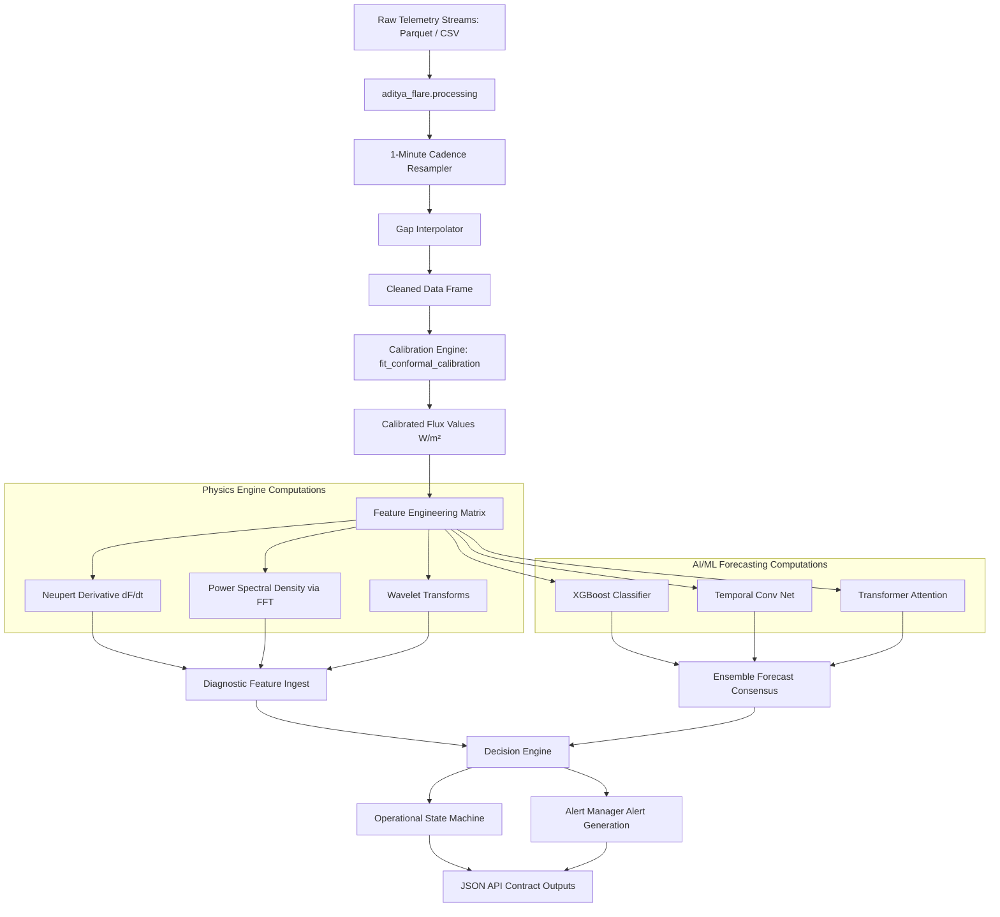

# Data Flow Documentation — Aditya-L1 Space Weather Platform

This document describes the end-to-end data pipeline from raw telemetry files to operational mission decisions.

---

## 1. End-to-End Data Pipeline

Below is the structured data flow diagram:

---

## 2. Pipeline Phase Execution

1.  **Ingestion & Alignment:**
    *   Reads daily parquet files and resamples to a 1-minute cadence.
    *   Aligns external reference streams (e.g. GOES XRS) with spacecraft payload measurements.
2.  **Physical Calibration:**
    *   Applies counts-to-flux calibration vectors to translate photon counts/sec into physical Solar Flare class ranges ($B, C, M, X$).
3.  **Compute Splitting:**
    *   **Physics Branch:** Calculates derivative curves and power spectra to map thermal changes.
    *   **AI Branch:** Assembles sequence vectors to generate probabilistic flare onset forecasts.
4.  **Operational Triggers:**
    *   Takes probability levels and physical flags to drive the deterministic spacecraft state machine.
    *   Dispatches actions (such as triggering spacecraft high-cadence burst acquisition) based on the calculated alert states.
