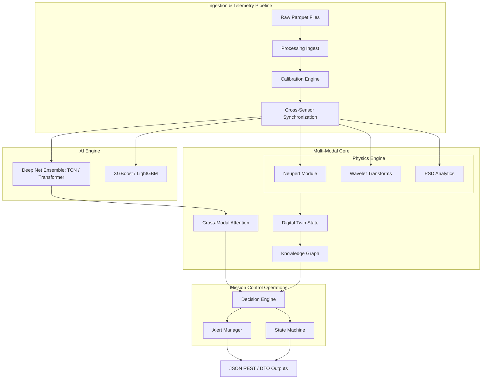

# Master Architecture Report — Aditya-L1 Space Weather Platform

This document describes the repository structure, high-level architecture, and cross-module interfaces for the Aditya-L1 Space Weather Intelligence Platform.

---

## 1. Repository Tree

Below is the directory mapping of the project core segments:

```
├── aditya_flare/                   # AI/ML & Decision Engine Core
│   ├── ai_engine/                  # Deep learning models & benchmarks
│   │   ├── models/                 # Neural architectures (TCN, Transformer, Dual-Stream)
│   │   ├── train.py                # ML Training pipelines
│   │   ├── predict.py              # ML Inference orchestration
│   │   └── benchmark.py            # Evaluation & baseline comparator
│   ├── calibration/                # Cross-calibration algorithms (GOES/SoLEXS)
│   ├── config/                     # System-wide configuration schemas
│   ├── decision/                   # Operational triggers and risk thresholds
│   │   ├── alert_manager.py        # Prioritized alarm dispatcher
│   │   ├── state_machine.py        # Space-segment state logic
│   │   └── recommendation.py       # Actions & plain-text recommendations
│   ├── evaluation/                 # Metrics calculators (TSS, HSS, Brier)
│   ├── models/                     # Dataset builders and space trigger models
│   ├── multi_modal/                # Spacecraft payload fusion networks
│   │   ├── digital_twin/           # Active region tracking models
│   │   ├── fusion/                 # Cross-modal cross-attention layers
│   │   └── knowledge_graph/        # Relational event mapping
│   ├── processing/                 # Data cleansing & raw stream ingestion
│   └── visualization/              # Plotting, SHAP, and report generation
├── physics_engine/                 # Thermodynamic & Spectral diagnostics
│   ├── entropy.py                  # Complexity/thermodynamic statistics
│   ├── neupert.py                  # Neupert effect derivatives
│   ├── spectral.py                 # Power Spectral Density (PSD) analysis
│   └── wavelets.py                 # Wavelet scalogram transforms
├── scripts/                        # Production daemons, downloads, & trainers
├── docs/                           # Documentation and audit baselines
├── tests/                          # 29 unit and regression tests
└── requirements.txt                # System library definitions
```

---

## 2. High-Level Architecture Diagram



---

## 3. Module Interface Architecture

The platform uses decoupled functional layers:
1. **Calibration Module:** Converts raw instrument photon count rates (e.g. from SoLEXS) into physical reference flux units ($W/m^2$ equivalent to GOES).
2. **Physics Engine:** Analyzes time-series derivatives (Neupert effect) and frequency spectra (PSD, wavelets) to flag solar pre-heating signs.
3. **AI/ML Engine:** Consumes multi-horizon features to calculate short-term event probability.
4. **Decision Engine:** Evaluates output confidence levels, manages operational alert states, and flags sensor drifts.
