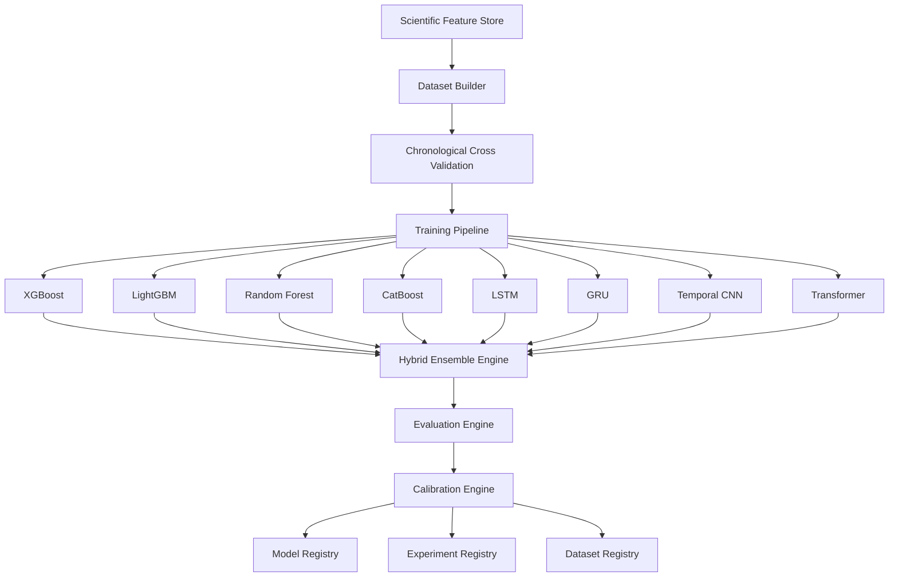

# Scientific Machine Learning Platform

The Scientific Machine Learning Platform represents the complete model training, calibration, evaluation, and selection pipeline for the Aditya-L1 Space Weather Nowcasting Engine.

## Architecture

## Core Modules

- **`models/`**: Supported algorithms wrapping training, evaluation, saving, and loading interfaces.
- **`registry/`**: Immutable records of versioned models and their deployment stages.
- **`experiments/`**: Logging and tracking parameters and cross-validation performance.
- **`datasets/`**: Compiling, validating, and versioning train/val/test splits.
- **`training/`**: Cross-validation walk-forward splits and training management.
- **`evaluation/`**: Mathematical calculations of macro metrics, confusion matrices, reliability curves, and learning curves.
- **`calibration/`**: Probability scaling (Platt, Temperature, Isotonic, Conformal Prediction).
- **`monitoring/`**: Tracking feature drift, prediction drift, and calibration health.
- **`serving/`**: REST API endpoints for pipeline interactions.
