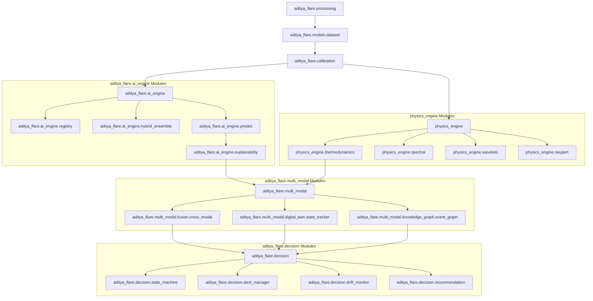

# Module Dependency Map — Aditya-L1 Space Weather Platform

This document outlines the dependencies and import relations of the core packages within the platform.

---

## 1. Dependency Graph

Below is the visualization of the data and compute paths across modules:

---

## 2. Core Modules Architecture

1.  **Ingestion & In-Memory Pipeline (`aditya_flare.processing` & `dataset`):**
    *   No external package imports besides `pandas`, `numpy`, and `pathlib`.
    *   Responsible for converting raw Parquet streams into aligned multi-column datasets.
2.  **Physics Analytics (`physics_engine`):**
    *   Purely scientific NumPy/SciPy operations.
    *   Provides feature matrix vectors to the ML pipeline.
3.  **Machine Learning Engine (`aditya_flare.ai_engine`):**
    *   Depends on `scikit-learn`, `xgboost`, `lightgbm`, and `torch`.
    *   Loads models registered under `registry.py` and returns probability vectors.
4.  **Decision Controls (`aditya_flare.decision`):**
    *   Consumes the physics metrics and AI model probability outputs.
    *   Maintains the spacecraft state machine.
5.  **Multi-Modal Fusion (`aditya_flare.multi_modal`):**
    *   Acts as the aggregator connecting physical states (digital twin), mission logs (knowledge graph), and models.
