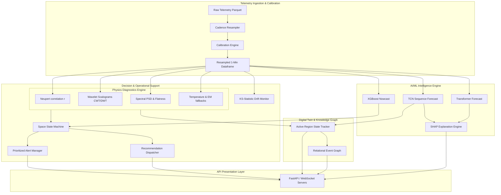

# System Architecture Specification — Aditya-L1 Platform

This document describes the subsystem architecture, communication patterns, and module integration interfaces for the Aditya-L1 Space Weather Intelligence Platform.

---

## 1. Unified Subsystem Architecture

The platform uses a modular design to separate data collection, processing, forecasting, decision-making, and visualization.

---

## 2. Subsystem Communication Specifications

### 2.1 Telemetry to Physics Engine
*   **Method:** In-process Pandas DataFrame pass.
*   **Cadence:** 1-minute steps.
*   **Data Payload:** Aligned telemetry profiles containing `solexs_sdd2_ctr`, `hel1os_flux`, and `suit_uv_mean`.
*   **Protocol:** Local Python reference transfers.

### 2.2 Telemetry to AI Engine
*   **Method:** Sequence tensor batch generation.
*   **Cadence:** Continuous on telemetry update.
*   **Data Payload:** 60-minute historical feature window matrices containing derivatives, trends, and calibrated intensities.
*   **Protocol:** PyTorch tensor allocations.

### 2.3 AI & Physics outputs to Decision Engine
*   **Method:** Local parameter passing.
*   **Cadence:** Evaluated every 1 minute.
*   **Data Payload:** Ensemble nowcast class predictions, forecast probabilities, Neupert derivatives, and telemetry packet drop indicators.
*   **Protocol:** Local Python dictionaries.

---

## 3. Subsystem Descriptions

1.  **Ingestion & Calibration Engine:** Standardizes incoming multi-payload telemetry onto a uniform 1-minute cadence and converts counts to physical units.
2.  **Physics Diagnostics Engine:** Calculates spectral energy, wavelet coefficients, and thermodynamic trends to identify pre-flare thermal anomalies.
3.  **AI & Forecasting Engine:** Combines fast decision forests with deep attention models to predict flare probabilities.
4.  **Operational Decision Engine:** Runs the spacecraft state machine and evaluates anomaly alerts to generate recommendations.
5.  **Digital Twin & Knowledge Graph:** Matches active region properties to reference templates and maps connections between solar events.
