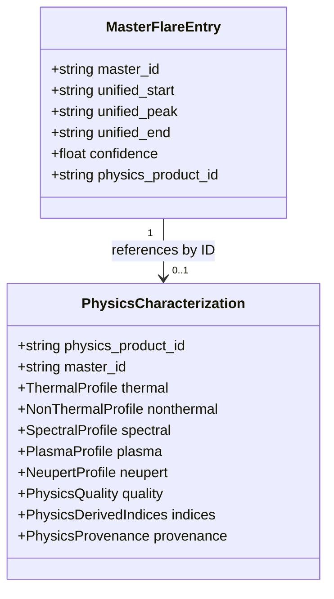

# Physics Repository Architecture

The **Physics Repository** serves as the central storage layer for full physical characterizations of solar events. It is decoupled from the **Master Flare Catalog** to maintain computational efficiency and prevent memory bloat.

## Decoupled Architecture
- The **Master Flare Catalog** stores lightweight event metadata, detection timestamps, confidence levels, and a reference string: `physics_product_id`.
- The **Physics Repository** holds the detailed, high-resolution nested physics records (containing profiles, time-series arrays, quality matrices, and provenance details) matching the `physics_product_id`.

## Key Operations
- **`store(product)`**: Computes and assigns a unique, structured identifier of format `PHY-YYYYMMDD-NNN` (where `NNN` is an incrementing sequence number reset daily), stores the record, and returns the ID.
- **`get_by_id(physics_product_id)`**: Performs direct lookup of the detailed physics.
- **`get_by_master_id(master_id)`**: Resolves physics data via the Master Flare Catalog ID.
- **`search(query)`**: Filters stored products by IDs.
- **`get_statistics()`**: Computes moving stats such as the overall quality score and average thermal energy.
