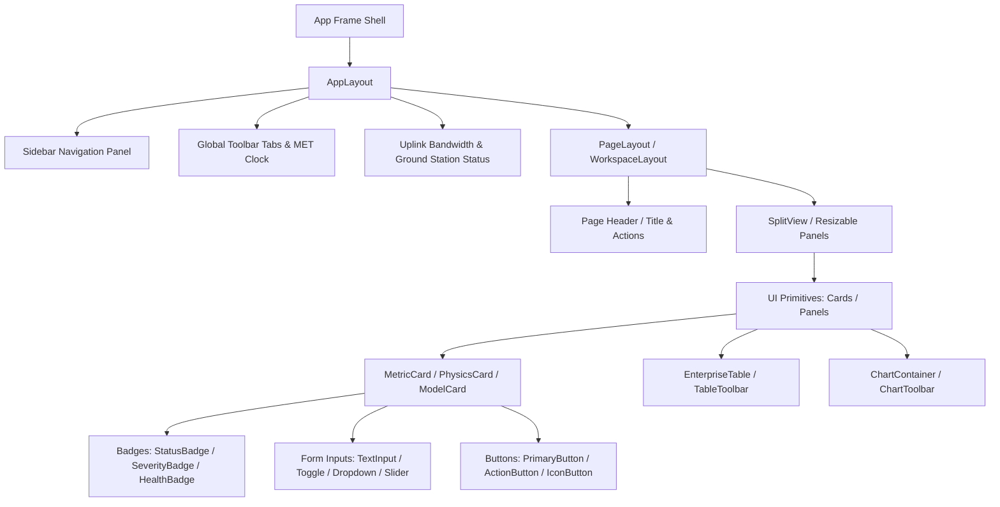

# Aditya-L1 Enterprise Design System

A high-fidelity, high-density, mission-critical Design System & Component Library tailored for aerospace operations, solar telemetry surveillance, and AI consensus monitoring. Inspired by Palantir Foundry, NASA mission control software, and GitHub Enterprise.

---

## 1. Directory Structure

The design system lives entirely within `src/design-system/`. It is structured to separate design tokens, theme helpers, UI primitives, and utilities into dedicated modules:

```text
src/design-system/
├── tokens/             # Spacing, color variables, typography scales, radius, transitions
│   └── index.ts
├── theme/              # CSS Custom Properties injector, baseline theme parameters
│   └── index.ts
├── components/         # Standardized UI Primitives
│   ├── layouts.tsx     # AppLayout, PageLayout, Sidebar, Header, ResizablePanel
│   ├── buttons.tsx     # PrimaryButton, SecondaryButton, GhostButton, IconButton
│   ├── cards.tsx       # MetricCard, StatusCard, AlertCard, ModelCard, SummaryCard
│   ├── badges.tsx      # StatusBadge, HealthBadge, SeverityBadge, PhysicsBadge
│   ├── charts.tsx      # ChartContainer wrapper, ChartToolbar, ChartLoading
│   ├── tables.tsx      # EnterpriseTable, TableToolbar, SearchBar, Pagination
│   ├── forms.tsx       # TextInput, SearchInput, Dropdown, MultiSelect, Toggle
│   ├── dialogs.tsx     # Modal, Drawer, InspectorPanel
│   ├── feedback.tsx    # Alert, Toast, SkeletonLoader, EmptyState, OfflineState
│   ├── navigation.tsx  # SidebarNavigation, WorkspaceSwitcher, Tabs
│   └── utilities.tsx   # Tooltip, Popover, Avatar, Chip, Timeline, CommandPalette
├── hooks/              # Custom design system React hooks (useUtcClock, usePressScale)
├── animations/         # CSS transitions & keyframe parameters (blink, pulse, fade)
└── index.ts            # Central barrel exports
```

---

## 2. Design Tokens

Design Tokens act as the single source of truth for visual specs, configured via CSS Variables and TypeScript constants.

### Spacing Scale
High-density spacing matching military-grade telemetry dashboards:
- `spacing.xxs` = `4px`
- `spacing.xs`  = `8px`
- `spacing.sm`  = `12px`
- `spacing.md`  = `16px`
- `spacing.lg`  = `24px`
- `spacing.xl`  = `32px`
- `spacing.xxl` = `48px`

### Radius Scale
Corner styling for windows, overlays, and inline controls:
- `radius.xs`   = `4px`
- `radius.sm`   = `6px`
- `radius.md`   = `8px` (Standard inputs)
- `radius.lg`   = `12px` (Standard panels)
- `radius.xl`   = `18px` (Main workspace window container)
- `radius.full` = `9999px`

### Color Palette (Tokens)
- **Primary Accent** (`#5B5CEB`): Ground-control primary interactive states, tabs, highlights.
- **Secondary Accent** (`#FF6A3D`): Active solar region indicator, CME highlights, live telemetry streams.
- **Nominal/Success State** (`#22C55E`): Nominal links, green status indicator, optimal sensor states.
- **Degraded/Warning State** (`#EAB308`): Degraded instrument signal, queue lag, heavy GPU load.
- **Critical/Error State** (`#BA1A1A`): Over-temperature warning, transponder link outage.
- **Surface Fill** (`#F7F9FA`): Ground control light background.
- **Inverse Surface** (`#2D3133`): Live solar video stream backgrounds, dark console containers.

---

## 3. UI Component Hierarchy

All pages are built deterministically from the design system's modular blocks. High-level layouts compose atomic cards, which in turn contain interactive badge and button primitives:



---

## 4. Reusable UI Primitives & API Contracts

Every component follows a highly standardized prop structure to ensure predictable behavior:

```typescript
export interface BaseProps {
  title?: React.ReactNode;
  subtitle?: React.ReactNode;
  children?: React.ReactNode;
  className?: string;
  variant?: string;
  size?: 'sm' | 'md' | 'lg';
  loading?: boolean;
  disabled?: boolean;
  error?: boolean | string;
  status?: string;
  actions?: React.ReactNode;
  icon?: string;
  footer?: React.ReactNode;
  badge?: React.ReactNode;
}
```

### Component Highlights

#### `EnterpriseTable`
Handles large tabular streams (such as raw counts, historical matches, and sensor logs) with:
- Standardized columns structure using `ColumnDef<T>`
- Interactive row selection and hover styling
- Custom actions bar, toolbar titles, and CSV export triggers
- Built-in status tracker (`TableStatus`) and loading skeleton state (`TableSkeleton`)

#### `BaseCard`
Used for dashboard grids, telemetry modules, and AI panels. Supplying `value` automatically triggers the bento-style numeric layout, while omitting it treats the card as a modular content panel:
- Bento/Glass/Panel variants supported
- Built-in loading overlays, error boundaries, and empty indicators
- Header toolbar slots for filters, refresh locks, and export overlays

---

## 5. Development Guidelines & Best Practices

1. **Do Not Hardcode Dimensions or Colors**: Always use design tokens (Tailwind colors or CSS custom variables) such as `border-outline-variant` and `font-numeric-telemetry`.
2. **Type-Safe Columns**: When defining tables, always declare the row interface explicitly and use `ColumnDef<RowType>[]` from `@design-system/index`.
3. **Prevent Re-renders**: Heavy lists, charts, and trees must be wrapped in `React.memo` or use virtualization when dealing with >500 rows.
4. **Icons Standard**: Use the `<Icon name="icon_name" />` component to draw symbols from the Material Symbols Outline set. Do not write bare `<span className="material-symbols-outlined">`.
5. **No Style Leaks**: Avoid editing `index.css` directly. Component modifications must be encapsulated in their respective `.tsx` files or scoped classes.
